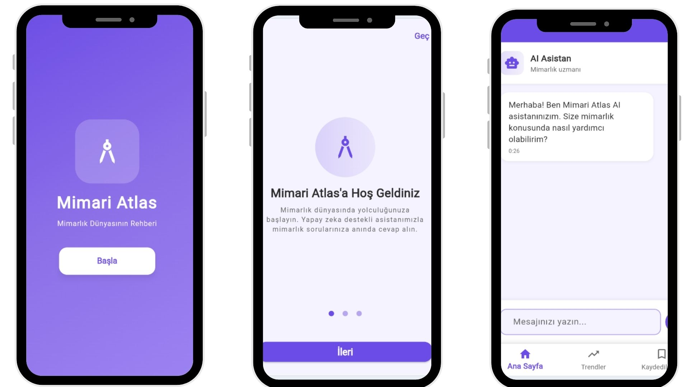
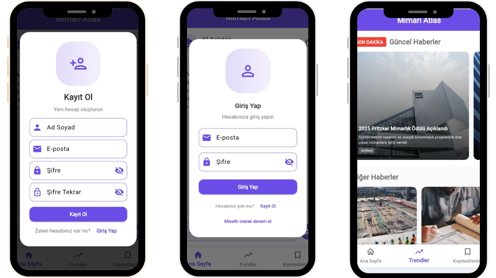

# Mimarlık Uygulaması (Riverpod + Dio)

AI destekli mimarlık haberleri, makaleler ve soru-cevap platformu. **Riverpod** state management ve **Dio** HTTP client kullanılarak geliştirilmiştir.

##  Neden Atlas of Architecture?

Mimarlık alanında bilgiye hızlı ulaşma ihtiyacı ve  
AI teknolojilerinin sunduğu yeni olanaklar bir araya getirilerek  
mimarların ve öğrencilerin **tek platformdan** soru sorabileceği  
ve sektörü takip edebileceği bir uygulama geliştirilmiştir.

## Özellikler

-  **AI Mimari Chat**
    - Mimari kavramlar, proje süreçleri ve teknik sorular için yapay zekâ destekli sohbet
-  **Trend Mimarlık Haberleri**
    - Güncel mimarlık haberleri ve sektörel gelişmeler
-  **Öğrenci & Profesyonel Odaklı**
    - Mimarlık öğrencileri ve mimarlar için özel tasarım
-  **Sade & Modern UI**
    - Kullanıcı odaklı ve erişilebilir arayüz

##  Ekranlar

  

  

## Teknolojiler

- **Frontend**: Flutter, Dart
- **State Management**: **Riverpod**
- **HTTP Client**: **Dio**
- **Backend**: Firebase
    - Authentication (Email/Password)
    - Firestore Database
    - Cloud Storage
- **AI**: Google Gemini API

## Lisans

MIT Lisansı - Eğitim amaçlıdır.

---

**Geliştirme:** Riverpod + Dio ile modern Flutter uygulaması 🚀